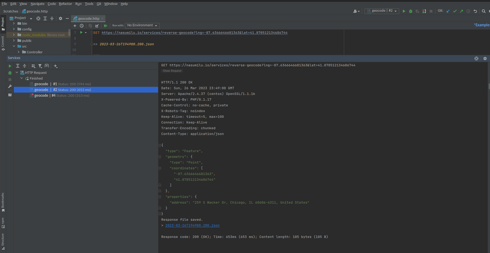

# Reverse Geocoder Services

To change between the different reverse geocode service providers, change the configuration at 
`config/packages/geocoder.yaml` to indicate the appropriate provider.

- [ESRI World Geocoder](#esri-world-geocoder-service)
- [HERE](#here-geocoder-service)


## Screenshots




## Esri World Geocoder Service

Need to document

## Here Geocoder Service

The HERE geocoder service requires an account and an api-key. Information on establishing an account and obtaining
an api-key is found at https://developer.here.com/products/geocoding-and-search.

In the `config/packages/geocoder.yaml` set the `nasumilu_geocoder.reverse_geocoder` property value to `here`. Then, add 
the `HERE_API_KEY` to the applications `.env` file.

### Example

```shell
# .env
###> nasumilu/geocoder-bundle ###
# Geocode
# IMPORTANT: Use these to set the service providers API key when needed for more information
#            see config/packages/geocoder.yaml
#
HERE_API_KEY='my-here-api-key'
###< nasumilu/geocoder-bundle ###
```

- [Back to nasumilu/geocoder-bundle](../README.md)